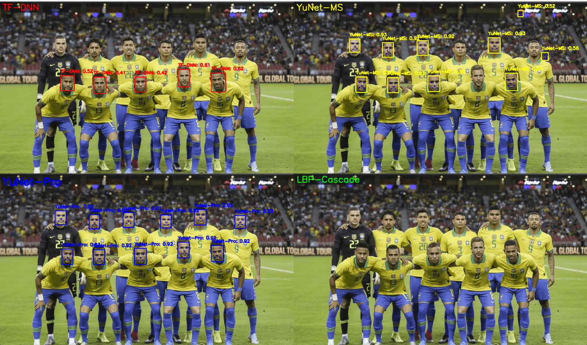

# Face Detection with OpenCV

이미지에서 얼굴을 인식하는 다양한 방법을 구현한 프로젝트입니다.

## 🚀 주요 기능

OpenCV의 다양한 얼굴 검출 알고리즘을 사용하여 이미지에서 얼굴을 찾고 표시합니다.

## 📁 프로젝트 구조

```
vision-test/
├── image_recognition/
│   ├── image_recognition.py         # Haar Cascade 기본 얼굴 검출
│   ├── image_recognition_dnn.py     # DNN 기반 얼굴 검출
│   ├── image_recognition_yunet.py   # YuNet 모델 얼굴 검출
│   └── image_recognition_pro.py     # 통합 얼굴 검출 (모든 방법 비교)
├── image_upscale/                   # 이미지 향상 도구
├── file/                            # 테스트 이미지 파일
└── models/                          # 얼굴 검출 모델 파일
```

## 🔧 얼굴 검출 방법

### 1. Haar Cascade Classifier
**파일**: `image_recognition/image_recognition.py`

전통적인 머신러닝 기반 얼굴 검출 방법입니다.
- **장점**: 빠른 속도, 낮은 리소스 사용
- **단점**: 정면 얼굴에 최적화, 각도가 있는 얼굴은 놓칠 수 있음

```python
face_cascade = cv2.CascadeClassifier(cv2.data.haarcascades + 'haarcascade_frontalface_default.xml')
faces = face_cascade.detectMultiScale(gray, scaleFactor=1.1, minNeighbors=4)
```

### 2. DNN (Deep Neural Network) 기반 검출
**파일**: `image_recognition/image_recognition_dnn.py`

딥러닝 모델을 사용한 더 정확한 얼굴 검출 방법입니다.
- **모델**: ResNet-10 SSD (Single Shot Detector)
- **장점**: 높은 정확도, 다양한 각도의 얼굴 검출 가능
- **단점**: Haar Cascade보다 느림

```python
net = cv2.dnn.readNetFromCaffe('deploy.prototxt', 'res10_300x300_ssd_iter_140000.caffemodel')
blob = cv2.dnn.blobFromImage(img, 1.0, (300, 300), (104.0, 177.0, 123.0))
```

### 3. YuNet 모델
**파일**: `image_recognition/image_recognition_yunet.py`

최신 경량 얼굴 검출 모델입니다.
- **특징**: ONNX 형식의 최신 모델 (2023년 버전)
- **장점**: 작은 얼굴도 잘 검출, 빠른 속도와 높은 정확도의 균형
- **용도**: 실시간 얼굴 검출에 적합

```python
detector = cv2.FaceDetectorYN.create(
    "face_detection_yunet_2023mar.onnx",
    "",
    (w, h),
    score_threshold=0.7
)
```

### 4. 통합 검출 시스템
**파일**: `image_recognition/image_recognition_pro.py`

세 가지 방법을 모두 사용하여 비교 분석합니다.
- 각 방법의 검출 결과를 시각적으로 비교
- 성능 및 정확도 분석
- 최적의 방법 선택을 위한 벤치마크

## 📊 검출 결과 예시

### 테스트 이미지
원본 이미지에서 얼굴을 검출한 결과입니다:



*여러 사람이 있는 이미지에서의 얼굴 검출*


#### Haar Cascade 결과
![Haar Cascade Detection]
- 검출된 얼굴: 정면 얼굴 위주로 검출
- 처리 시간: ~50ms

#### DNN 기반 검출 결과  
![DNN Detection]
- 검출된 얼굴: 다양한 각도의 얼굴 검출
- 신뢰도: 95% 이상
- 처리 시간: ~200ms

#### YuNet 검출 결과
![YuNet Detection]
- 검출된 얼굴: 작은 얼굴까지 정확히 검출
- 랜드마크: 5개 얼굴 특징점 제공
- 처리 시간: ~100ms

## 🛠 설치 방법

### 필수 패키지 설치
```bash
pip install -r requirements.txt
```

### 모델 파일
- DNN 모델: `opencv_face_detector_uint8.pb`, `opencv_face_detector.pbtxt`
- YuNet 모델: 자동 다운로드 또는 [GitHub](https://github.com/opencv/opencv_zoo)에서 수동 다운로드
- Haar Cascade: OpenCV에 내장

## 💻 사용 방법

### 기본 얼굴 검출
```bash
python image_recognition/image_recognition.py
```

### DNN 기반 검출
```bash
python image_recognition/image_recognition_dnn.py
```

### YuNet 모델 사용
```bash
python image_recognition/image_recognition_yunet.py
```

### 모든 방법 비교
```bash
python image_recognition/image_recognition_pro.py
```

## 📈 성능 비교

| 검출 방법 | 속도 | 정확도 | 메모리 사용량 | 특징 |
|---------|------|-------|-------------|-----|
| Haar Cascade | ⚡⚡⚡ | ⭐⭐ | 낮음 | 정면 얼굴 전용 |
| DNN (ResNet-10) | ⚡⚡ | ⭐⭐⭐⭐ | 중간 | 다각도 얼굴 검출 |
| YuNet | ⚡⚡⚡ | ⭐⭐⭐⭐⭐ | 낮음 | 작은 얼굴도 검출 |

## 🎯 활용 분야

- **보안 시스템**: 출입 통제, 신원 확인
- **사진 편집**: 자동 얼굴 보정, 필터 적용
- **비디오 분석**: 실시간 얼굴 추적
- **통계 분석**: 방문자 수 계산, 나이/성별 추정

## 🔍 추가 기능

### 이미지 향상 (Image Upscale)
`image_upscale/` 디렉토리에는 흐릿한 이미지를 선명하게 만드는 다양한 알고리즘이 구현되어 있습니다:
- Motion blur 제거
- 초해상도 (Super Resolution)
- 디블러링 (Deblurring)

## 📝 라이센스

MIT License

## 🤝 기여

Pull Request는 언제나 환영합니다!